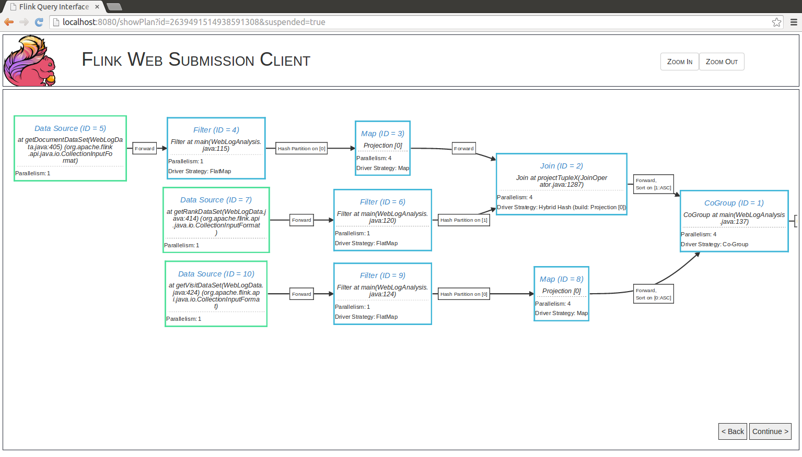

## 执行计划

根据各种参数（如数据大小或群集中的计算机数量），Flink的优化器会自动为您的程序选择执行策略。 在许多情况下，了解Flink将如何执行您的程序会很有用。

Flink附带了一个用于执行计划的可视化工具。 包含可视化工具的HTML文档位于tools / planVisualizer.html下。 
用json格式表示job的执行计划，并将其可视化为具有执行策略的完整注释的图。

以下代码显示了如何从程序中打印执行计划：
```java
final ExecutionEnvironment env = ExecutionEnvironment.getExecutionEnvironment();
...

System.out.println(env.getExecutionPlan());
```
要可视化执行计划，请执行以下操作：
1. 使用你的web浏览器打开planVisualizer.html
2. 将json字符串粘贴至文本输入框
3. 点击绘图按钮
完成这些步骤后，将显示详细的执行计划。




## Web界面

Flink提供用于提交和执行作业的Web界面。 该接口是JobManager用于监控的Web界面的一部分，默认情况下在端口8081上运行。
通过此接口提交作业需要在flink-conf.yaml中设置jobmanager.web.submit.enable：true。

可以在执行作业之前指定程序参数。 通过执行计划可视化可视化，可以在执行Flink作业之前显示执行计划。